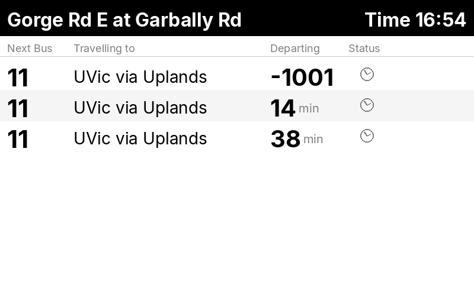

# Bus Stop Display System (BSDS)

A real-time bus arrival display for transit stops using a Raspberry Pi with a Waveshare e-ink display.



## Features

- **Real-time arrivals** via GTFS-RT or MINT API predictions
- **Static schedule fallback** when real-time data is unavailable
- **E-ink display support** for Waveshare displays via omni-epd
- **Web configuration** interface for setup and preview
- **Offline capable** with bundled wheels and pruned GTFS caching
- **Power management** with quiet hours support

## Quick Start

```bash
# Create virtual environment
python3 -m venv venv
source venv/bin/activate

# Install dependencies
pip install -r requirements.txt

# Run with mock display (for testing)
python -m src.main --mock

# Access web interface at http://localhost:5000
```

## Data Source Modes

| Mode | Description |
|------|-------------|
| **GTFS** | Uses static GTFS ZIP + optional GTFS-RT feed |
| **MINT** | Uses MINT/MIXRE API for ML-enhanced predictions with GTFS fallback |

## Documentation

- [Deployment Guide](docs/DEPLOYMENT.md) - Hardware setup, offline installation, systemd service
- [Configuration Guide](docs/CONFIGURATION.md) - All configuration options and data source modes

## Hardware Requirements

- Raspberry Pi (3B+, 4, or Zero 2 W)
- Waveshare e-Paper display (7.5" V2 recommended)
- 16GB+ MicroSD card
- 5V 2.5A power supply

## Project Structure

```
bsds/
├── src/
│   ├── main.py           # Entry point
│   ├── config.py         # Configuration management
│   ├── display_driver.py # E-ink hardware abstraction
│   ├── gtfs_parser.py    # GTFS data parsing
│   ├── schedule_provider.py  # Data source abstraction
│   ├── renderer.py       # Display rendering
│   └── web/              # Flask web interface
├── packages/             # Bundled dependencies for offline install
│   ├── wheels/           # Python wheels
│   ├── omni-epd/         # E-ink driver library
│   └── e-Paper/          # Waveshare drivers
├── docs/                 # Documentation
└── tests/                # Unit tests
```

## License

Part of the MIXRE project.

